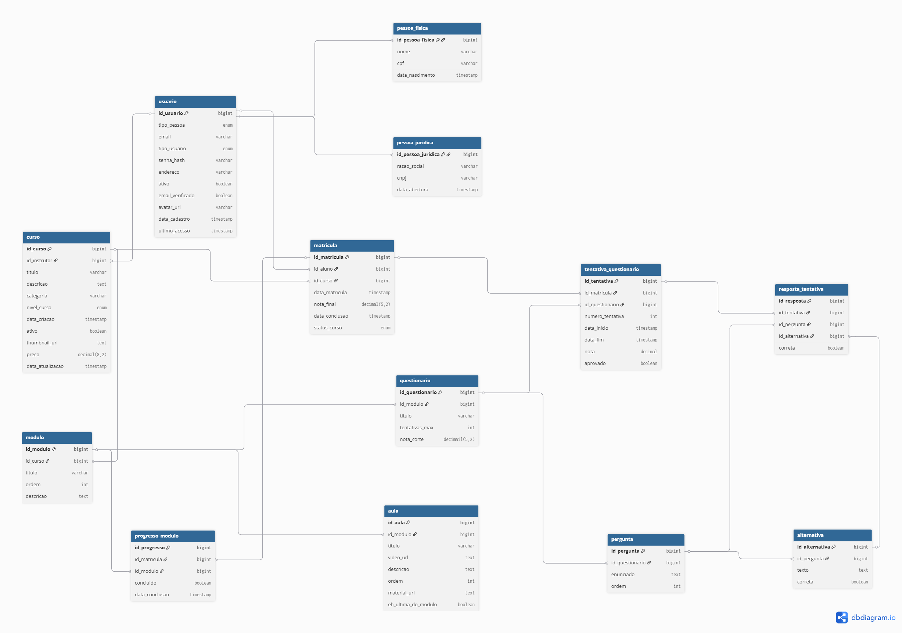

# 📚 EADFlow – Plataforma de Gestão de Cursos Online

Uma plataforma completa de cursos online, com sistema de usuários, cursos, aulas, avaliações, matrículas, certificados, permissões e pagamentos simulados.

---


## 🧱 Tecnologias

| Categoria | Tecnologias |
|---|---|
| Linguagem | Java 21+ |
| Framework | Spring Boot (Web, Security, JPA, Validation, Scheduler) |
| Banco de Dados | PostgreSQL |
| Migrations | Flyway |
| Autenticação | Spring Security + JWT |
| Documentação | Swagger / OpenAPI |
| Testes | JUnit 5 + Mockito |
| Infraestrutura | Docker |
| CI/CD | Jenkins + Deploy na nuvem |
| Mensageria | Kafka |

---

## 🗂️ Modelo de Domínio (DER)




## 🔧 Funcionalidades

### 🔒 Autenticação e Cadastro
- Cadastro de usuários com confirmação por e-mail e link de validação
- Conta ativada somente após validação do e-mail
- Autenticação via JWT com perfis de acesso: `ADMIN`, `INSTRUTOR`, `ALUNO`

### 👨‍🏫 Instrutor
- Criar, editar e remover cursos, módulos e aulas (sem limite de quantidade)
- Criar questionários ao final de cada módulo com perguntas dissertativas ou de múltipla escolha
- Cadastrar gabarito para validação das respostas dos alunos
- Visualizar alunos matriculados nos seus cursos

### 👨‍🎓 Aluno
- Navegar pelo catálogo de cursos disponíveis
- Comprar e se matricular em cursos (sem limite de matrículas)
- Assistir aulas sem prazo de expiração
- Responder questionários ao final de cada módulo e avançar somente ao atingir a nota mínima
- Acompanhar progresso por curso
- Receber e baixar certificado em PDF ao concluir o curso
- Receber recomendações de cursos similares baseadas em machine learning

### 🧾 Pagamento (Simulado)
- Endpoint para simulação de pagamento do curso
- Liberação de acesso somente após confirmação do pagamento

### 📄 Certificados
- Geração automática em PDF ao concluir o curso
- Contém: nome do aluno, nome do curso, data de conclusão e código de verificação único

---

## 🧠 Validação de Respostas

- **Múltipla escolha:** comparação direta com o gabarito cadastrado
- **Dissertativa:** análise de similaridade semântica com algoritmos de machine learning (NLP)

---

## 🤖 Machine Learning

- Validação de respostas dissertativas por similaridade de contexto
- Sistema de recomendação de cursos baseado no histórico e perfil do aluno

---

## ⏰ Agendamento de Tarefas (`@Scheduled`)

- Envio de lembretes por e-mail para alunos com aulas não concluídas
- Verificação periódica de matrículas para atualização de status

---

## 📬 Mensageria (Kafka)

Eventos assíncronos gerenciados via fila de mensagens:

- Geração de certificados após conclusão de curso
- Envio de e-mails de confirmação de cadastro
- Envio de e-mails de confirmação de matrícula
- Notificações em massa para alunos

---


## 🐳 Infraestrutura

```bash
# Subir ambiente completo com Docker Compose
docker-compose up -d
```

- PostgreSQL em container
- Aplicação Spring Boot containerizada
- Pipeline CI/CD com Jenkins
- Deploy automatizado na nuvem

---


## 👥 Histórias de Usuário

### Instrutor

> Como instrutor, quero me cadastrar no sistema, receber um e-mail de confirmação com link de validação e, após validar, ter meu cadastro ativado.
>
> Quero criar cursos com preço entre R$25 e R$250, organizados em módulos e aulas (sem limite de quantidade). Quero criar questionários ao final de cada módulo com perguntas dissertativas ou de múltipla escolha, com gabarito previamente cadastrado. Ao concluir o curso, o aluno deve receber seu certificado em PDF automaticamente.

### Aluno

> Como aluno, quero me cadastrar no sistema, receber um e-mail de confirmação com link de validação e, após validar, ter meu cadastro ativado.
>
> Quero comprar e me matricular em cursos, assistir as aulas sem prazo de expiração e me matricular em quantos cursos quiser. Ao final de cada módulo, quero responder um questionário e avançar somente ao atingir a nota mínima. Ao concluir o curso, quero receber o link para download do meu certificado. Quero também receber recomendações de cursos similares.
